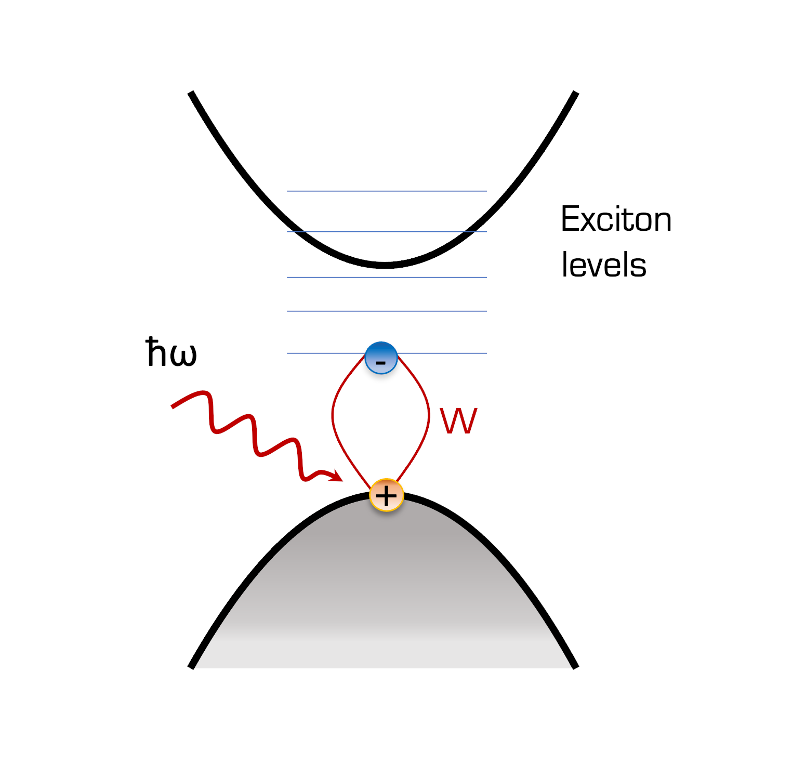
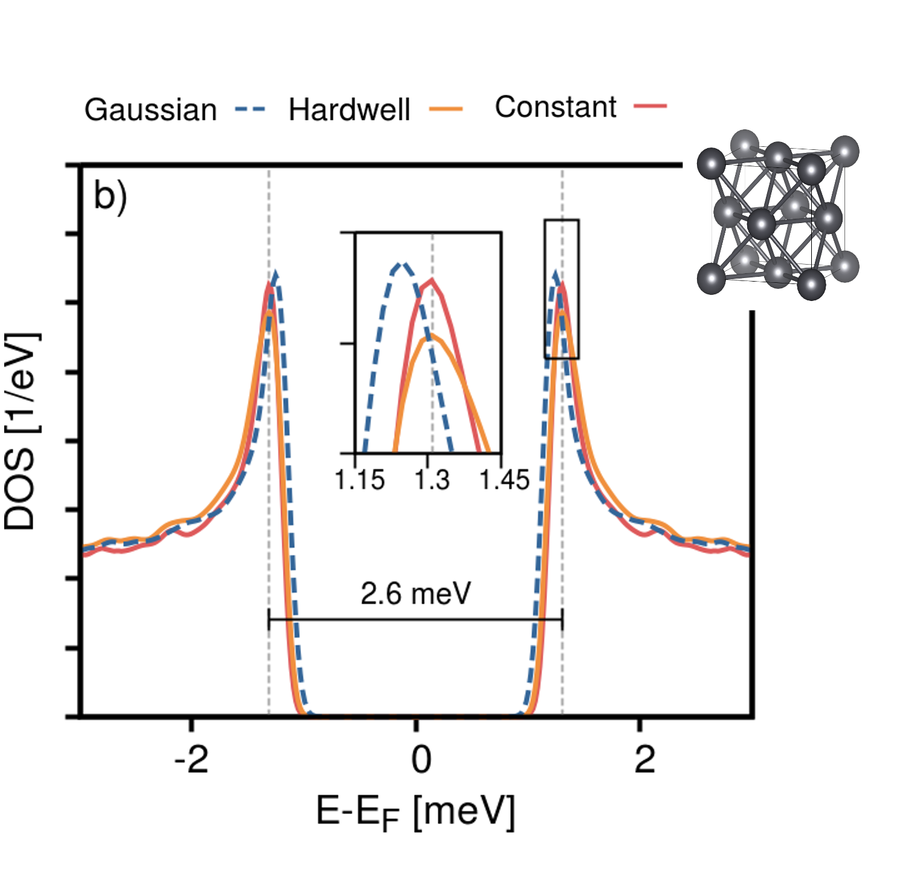
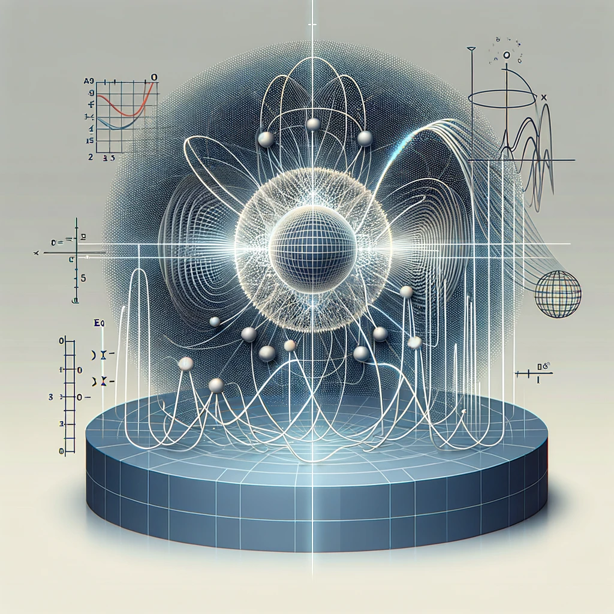

I build theoretical frameworks — and the code that makes them usable — to explain
how quantum materials absorb light, emit light, and carry current without
resistance. Three threads run through the work.

## Theoretical spectroscopy

{width=100% fig-alt="Absorption and photoluminescence spectra"}

I study the optical properties of two-dimensional multilayer structures built
from transition metal dichalcogenides (TMDs) and topological insulators such as
Bi₂Se₃. Reduced dimensionality and dielectric screening enhance the Coulomb
interaction between charge carriers, producing strongly bound electron–hole
pairs — excitons — that dominate the optical response.

Concretely, I work on:

- **Excitonic response of heterostructures** — how stacking order, twist angle
  and interlayer distance reshape the exciton spectrum
  ([Phys. Rev. B **110**, 035118](https://doi.org/10.1103/PhysRevB.110.035118)).
- **Real-time photoluminescence** from non-equilibrium many-body perturbation
  theory, implemented in the [Yambo](https://www.yambo-code.eu/) code.
- **Ultrafast carrier dynamics** in 2D Bi₂Se₃ nanoplatelets, in collaboration
  with experiment ([ACS Nano **19**, 17261](https://doi.org/10.1021/acsnano.4c14134)).

## Superconductivity

{width=100% fig-alt="Superconducting density of states"}

I combine Bogoliubov–de Gennes theory with density functional theory in a
unified approach — density functional Bogoliubov–de Gennes theory (DFT-BdG) —
which I extended to unconventional pairing and implemented in the
[SIESTA](https://siesta-project.org/) code
([Phys. Rev. B **110**, 134505](https://doi.org/10.1103/PhysRevB.110.134505)).

Applications include proximity-induced superconductivity in semiconductor–
superconductor heterostructures such as PbTe/Pb, relevant to topological
quantum computing platforms
([Phys. Rev. B **113** (2026)](https://doi.org/10.1103/r366-j5k6)).

## Topology in condensed matter

{width=100% fig-alt="Wannier and topology workflow"}

Berry curvature, Wannier functions and Chern numbers give a geometric reading of
electronic and optical response. I use Wannier-based tight-binding models,
interfaced with first-principles calculations, to connect microscopic band
geometry to measurable spectra.

## Codes and tools

| Code | Role |
|---|---|
| [Yambo](https://www.yambo-code.eu/) / [yambopy](https://github.com/yambo-code/yambopy) | GW, BSE, real-time dynamics — developer |
| [SIESTA](https://siesta-project.org/) | DFT-BdG for superconductors — developer |
| [Quantum ESPRESSO](https://www.quantum-espresso.org/) | Ground-state DFT and phonons |
| [Wannier90](https://wannier.org/) | Maximally localised Wannier functions |
| [AiiDA](https://www.aiida.net/) | High-throughput workflow management |

: {tbl-colwidths="[38,62]"}
