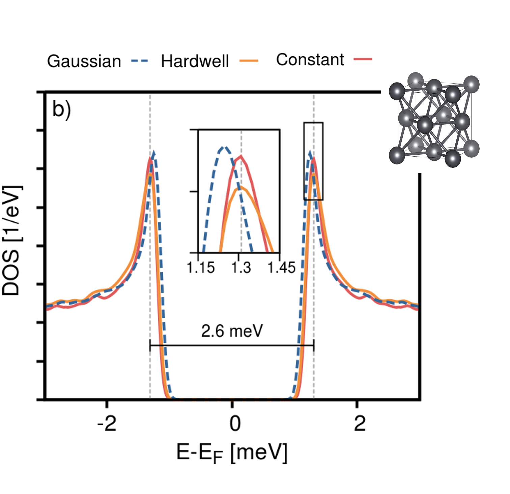
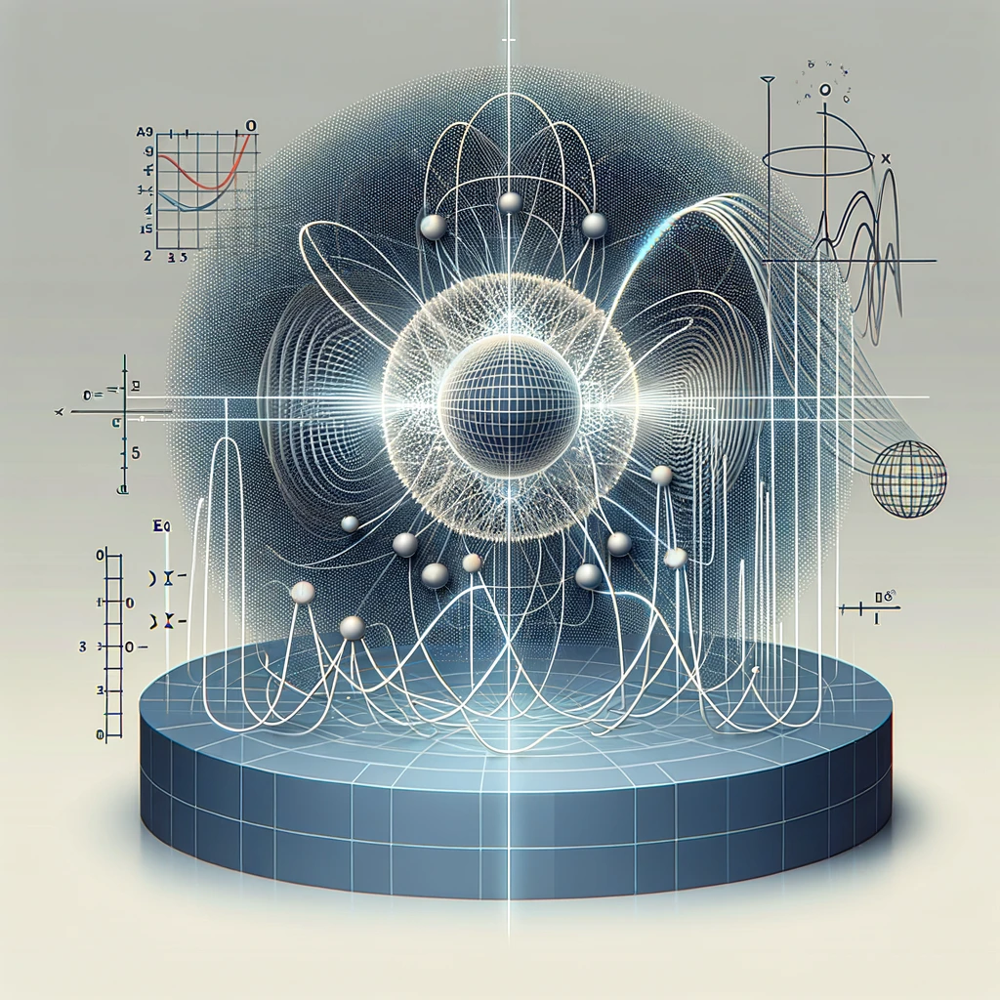

I build theoretical frameworks — and the code that makes them usable — to explain
how quantum materials absorb light, emit light, and carry current without
resistance. Three threads run through the work.

## Theoretical spectroscopy

```{=html}
<figure class="figure">
<video src="images/partition-coherent.mp4" poster="images/partition-coherent.png"
       autoplay loop muted playsinline style="width:100%;border-radius:8px"
       aria-label="Animated partition of an optical experiment: classical source and detector, quantized crystal, induced transverse current"></video>
<figcaption><a href="interactive/partition.html" target="_blank" rel="noopener">Open the interactive version →</a>
switch representation, turn the source off, and click any region for its equations.</figcaption>
</figure>
```

I study the optical properties of two-dimensional multilayer structures built
from transition metal dichalcogenides (TMDs) and topological insulators such as
Bi₂Se₃. Reduced dimensionality and dielectric screening enhance the Coulomb
interaction between charge carriers, producing strongly bound electron–hole
pairs — excitons — that dominate the optical response.

Concretely, I work on:

- **Excitonic response of heterostructures** — how stacking order, twist angle
  and interlayer distance reshape the exciton spectrum
  ([Phys. Rev. B **110**, 035118](https://doi.org/10.1103/PhysRevB.110.035118)).
- **Real-time photoluminescence** from non-equilibrium many-body perturbation
  theory, implemented in the [Yambo](https://www.yambo-code.eu/) code.
- **Ultrafast carrier dynamics** in 2D Bi₂Se₃ nanoplatelets, in collaboration
  with experiment ([ACS Nano **19**, 17261](https://doi.org/10.1021/acsnano.4c14134)).

### Light and matter on the same footing

An optical experiment splits the Universe in two. The laser and the detector
form a classical external world, which enters only through prescribed
potentials. The crystal is quantized: electrons, nuclei and transverse photons,
described by quantum electrodynamics in a Born–von Kármán volume. The laser's
transverse field drives a transverse current in the crystal. That current
radiates, and the detector records the total field, source plus induced.

The exact ground state of this system is a dressed photon state that is
orthogonal to the free photon vacuum in the thermodynamic limit, so
perturbation theory built on the vacuum fails. A canonical transformation
absorbs the photon dressing and leaves a purely fermionic [*transverse matter
Hamiltonian*](https://arxiv.org/abs/2608.21211), where photons are replaced by an instantaneous, screened
current–current interaction. Absorption then follows from the transverse
current–current response, the photon self-energy, and the macroscopic
dielectric function comes out in a form where every excitation line has
positive weight.

## Superconductivity

{width=100% fig-alt="Superconducting density of states"}

I combine Bogoliubov–de Gennes theory with density functional theory in a
unified approach — density functional Bogoliubov–de Gennes theory (DFT-BdG) —
which I extended to unconventional pairing and implemented in the
[SIESTA](https://siesta-project.org/) code
([Phys. Rev. B **110**, 134505](https://doi.org/10.1103/PhysRevB.110.134505)).

Applications include proximity-induced superconductivity in semiconductor–
superconductor heterostructures such as PbTe/Pb, relevant to topological
quantum computing platforms
([Phys. Rev. B **113** (2026)](https://doi.org/10.1103/r366-j5k6)).

## Gauges and topology

{width=100% fig-alt="Wannier and topology workflow"}

Many quantities in physics depend on a choice nobody can measure: the gauge of
the electromagnetic potentials, or the phases of Bloch states across the
Brillouin zone. Observables cannot depend on that choice, and working out what
survives it is often where the physics is. Fixing a gauge well (Coulomb,
velocity or length gauge for light–matter coupling, or smooth Bloch phases for
Wannier functions) makes a theory tractable and its approximations controlled.
When a smooth, global gauge does not exist, the obstruction is itself physical:
Berry phases, Berry curvature and Chern numbers are topological invariants that
fix quantized responses and protected boundary states.

I use this language in two directions: to choose representations of the
light–matter problem in which approximations stay gauge-invariant, and, through
Wannier-based tight-binding models interfaced with first-principles
calculations, to connect band geometry and topology to measurable spectra.

## Codes and tools

| Code | Role |
|---|---|
| [Yambo](https://www.yambo-code.eu/) / [yambopy](https://github.com/yambo-code/yambopy) | GW, BSE, real-time dynamics — developer |
| [SIESTA](https://siesta-project.org/) | DFT-BdG for superconductors — developer |
| [Quantum ESPRESSO](https://www.quantum-espresso.org/) | Ground-state DFT and phonons |
| [Wannier90](https://wannier.org/) | Maximally localised Wannier functions |
| [AiiDA](https://www.aiida.net/) | High-throughput workflow management |

: {tbl-colwidths="[38,62]"}
